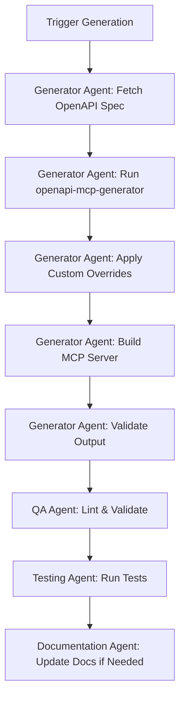
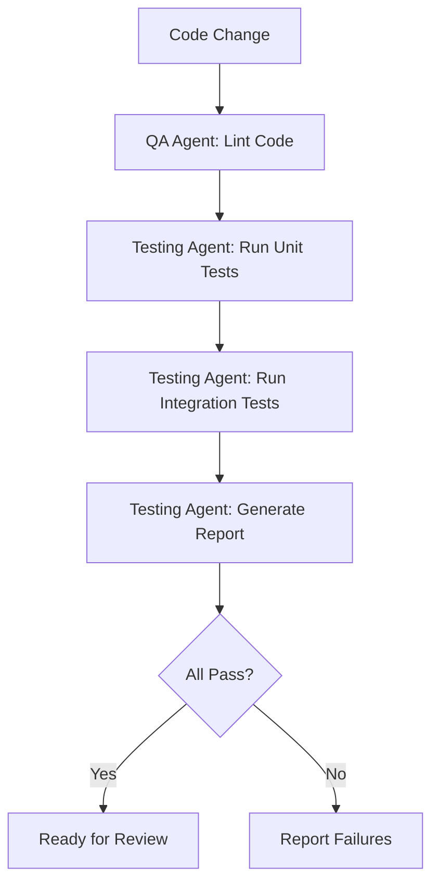

# Agent Configurations

This file defines agent roles, responsibilities, and configurations for the Windmill MCP Server project.

## Overview

This project uses AI agents to assist with development, maintenance, and testing. Each agent has specific areas of expertise and responsibility.

## Agent Roles

### 1. Generator Agent

**Specialty**: OpenAPI specification processing and MCP server generation

**Responsibilities**:

- Fetch latest Windmill OpenAPI specifications
- Execute openapi-mcp-generator with proper configuration
- Handle generation errors and edge cases
- Apply post-generation processing (overrides)
- Build the generated MCP server automatically
- Validate generated and built output

**Key Files**:

- `generator/config.json`
- `generator/fetch-spec.js`
- `generator/generate.js`
- `overrides/apply-overrides.js`

**Commands**:

```bash
# Full generation workflow (fetch → generate → override → build)
npm run generate

# Individual steps (if needed):
npm run fetch-spec          # Fetch OpenAPI spec only
npm run build:generated     # Build generated code only
```

**Build Process**:

The `npm run generate` command executes a complete workflow:

1. **Pre-generation** (`pregenerate` hook): Fetches OpenAPI spec from Windmill
2. **Generation**: Runs openapi-mcp-generator to create TypeScript code in `build/`
3. **Post-generation** (`postgenerate` hook):
   - Applies custom overrides from `overrides/`
   - Installs dependencies in `build/`
   - Compiles TypeScript to `build/dist/index.js`

**Output Structure**:

```
build/
├── src/
│   └── index.ts           # Generated MCP server code
├── build/
│   └── index.js           # Compiled JavaScript
├── package.json
└── node_modules/
```

**Troubleshooting**:

- If build fails, check `build/dist/index.js` exists after generation
- Generated code location changed from `src/` to `build/` in recent updates
- The complete workflow is now atomic - no need to manually build after generation

---

### 2. Override Management Agent

**Specialty**: Custom code preservation and merge strategies

**Responsibilities**:

- Apply custom overrides to generated code
- Detect and resolve merge conflicts
- Maintain override directory structure
- Validate override compatibility
- Document override patterns

**Key Files**:

- `overrides/**/*`
- `scripts/apply-overrides.js`
- `scripts/validate-overrides.js`

**Commands**:

```bash
npm run apply-overrides
npm run validate-overrides
```

---

### 3. Testing Agent

**Specialty**: Test creation and execution against Windmill instances

**Responsibilities**:

- Create and maintain test suites
- Execute tests against live Windmill instances
- Generate test reports
- Identify and document test failures
- Maintain test fixtures and utilities

**Key Files**:

- `tests/**/*`
- `tests/utils/windmill-client.js`
- `tests/config.js`

**Commands**:

```bash
npm test                    # Run all tests
npm run test:unit          # Run unit tests only
npm run test:e2e           # Run E2E tests (requires Docker)
npm run test:e2e:full      # Full E2E suite with setup
npm run test:coverage      # Generate coverage report
```

---

### 4. Documentation Agent

**Specialty**: Documentation maintenance and updates

**Responsibilities**:

- Keep README.md up to date
- Maintain API documentation
- Update `docs/project-plan.md` and `docs/sprints.md`
- Create tutorials and guides
- Ensure documentation accuracy

**Key Files**:

- `README.md`
- `docs/project-plan.md`
- `docs/sprints.md`
- `docs/**/*`

---

### 5. Quality Assurance Agent

**Specialty**: Code quality, linting, and best practices

**Responsibilities**:

- Run linters and formatters
- Ensure code style consistency
- Validate configuration files
- Security scanning
- Performance monitoring

**Commands**:

```bash
npm run lint
npm run format
npm run validate
```

---

## Agent Workflows

### Generation Workflow



**Note**: Steps B through F are now all executed by the single `npm run generate` command, making the workflow atomic and eliminating manual build steps.

### Testing Workflow



---

## Agent Coordination

### Sequential Tasks

When tasks must be completed in order:

1. Generator Agent generates code
2. Override Agent applies customizations
3. QA Agent validates code quality
4. Testing Agent runs tests
5. Documentation Agent updates docs

### Parallel Tasks

When tasks can be done simultaneously:

- Testing Agent runs different test suites in parallel
- QA Agent checks multiple file types concurrently
- Documentation Agent updates multiple docs

---

## Agent Guidelines

### For All Agents

**Do**:

- Follow existing code patterns and conventions
- Update relevant documentation
- Run tests before committing
- Use semantic commit messages
- Ask for clarification when uncertain

**Don't**:

- Make breaking changes without discussion
- Skip tests
- Ignore linter warnings
- Commit generated files (except in src/)
- Mix concerns in single commits

### Communication

Agents should communicate through:

- Commit messages (for code changes)
- Pull request descriptions (for reviews)
- Issue comments (for bugs/features)
- Sprint updates (for progress tracking)

---

## Configuration Management

### Environment Variables

Each agent may need different configuration. Store in `.env`:

```bash
# Windmill Instance Configuration
WINDMILL_BASE_URL=https://your-instance.windmill.dev
WINDMILL_API_TOKEN=your-token-here

# Generator Configuration
OPENAPI_SPEC_URL=https://app.windmill.dev/api/openapi.json
GENERATOR_OUTPUT_DIR=./src

# Testing Configuration
TEST_TIMEOUT=30000
TEST_WINDMILL_URL=https://test-instance.windmill.dev
TEST_WINDMILL_TOKEN=test-token

# Agent Behavior
AUTO_APPLY_OVERRIDES=true
VALIDATE_BEFORE_COMMIT=true
RUN_TESTS_ON_GENERATE=true
```

### Agent-Specific Settings

Store in respective config files:

- Generator: `generator/config.json`
- Testing: `tests/config.json`
- Overrides: `overrides/config.json`

---

## Monitoring & Metrics

### Success Metrics per Agent

**Generator Agent**:

- Generation success rate: > 95%
- Time to generate: < 5 minutes
- Breaking changes detected: 0

**Override Agent**:

- Override success rate: 100%
- Conflicts auto-resolved: > 80%
- Manual intervention needed: < 20%

**Testing Agent**:

- Test pass rate: > 95%
- Test coverage: > 80%
- False positives: < 5%

**Documentation Agent**:

- Documentation completeness: 100%
- Outdated docs: 0
- Broken links: 0

**QA Agent**:

- Lint errors: 0
- Security issues: 0
- Code smells: < 10

---

## Troubleshooting

### Common Agent Issues

**Generator fails to fetch spec**:

- Check OPENAPI_SPEC_URL is accessible
- Verify network connectivity
- Check for API changes

**Override conflicts**:

- Review conflict files in `overrides/conflicts/`
- Manually merge if needed
- Update override patterns

**Tests fail on live instance**:

- Verify instance is running
- Check credentials in .env
- Ensure test data is valid

**Documentation out of sync**:

- Run `npm run validate-docs`
- Review recent code changes
- Update relevant sections

---

## Agent Development

### Adding New Agents

1. Define role and responsibilities
2. Add section to this file
3. Create necessary scripts/configs
4. Add to package.json scripts
5. Document usage
6. Test thoroughly

### Modifying Agents

1. Update agent section in this file
2. Modify relevant scripts
3. Update tests
4. Update documentation
5. Notify team of changes

---

## Quick Reference

### All Agent Commands

```bash
# MCP Server Generation
npm run generate            # Complete generation workflow (fetch → generate → override → build)
npm run fetch-spec          # Fetch latest OpenAPI spec only
npm run build:generated     # Build generated code only

# Custom Overrides
npm run apply-overrides     # Apply custom overrides
npm run validate-overrides  # Check override validity

# Development
npm run dev                 # Run the MCP server directly

# Testing
npm test                    # Run all tests
npm run test:watch         # Run tests in watch mode
npm run test:ui            # Run tests with UI
npm run test:unit          # Run unit tests only
npm run test:e2e           # Run E2E tests (requires Docker)
npm run test:e2e:full      # Full E2E suite with setup
npm run test:coverage      # Generate coverage report

# Code Quality
npm run lint               # Run linter (ls-lint)
npm run lint:structure     # Check file structure
npm run format             # Format code (Prettier)
npm run validate           # Validate all configs

# Documentation
npm run docs:build         # Build documentation
npm run docs:validate      # Check for broken links

# Docker (Development & Testing)
npm run docker:dev         # Start Windmill dev environment
npm run docker:stop        # Stop Docker services
npm run docker:clean       # Clean Docker volumes
npm run docker:logs        # View Docker logs
npm run docker:wait        # Wait for services to be ready
```

---

## Version History

**v1.0** (2025-11-11): Initial agent configuration

- Defined 5 core agent roles
- Established workflows and guidelines
- Created coordination patterns

---

## Related Files

- [project-plan.md](../../docs/project-plan.md) - Project roadmap and phases
- [sprints.md](../../docs/sprints.md) - Sprint planning and tracking
- [README.md](../../README.md) - Main project documentation
