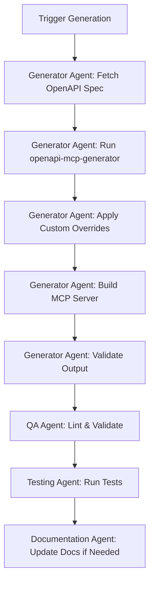
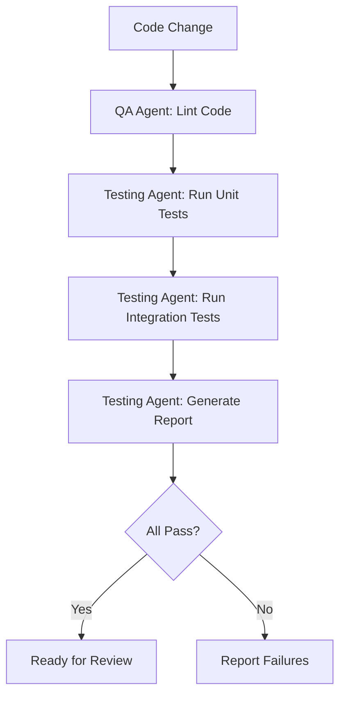

# Agent Configurations

This file defines agent roles, responsibilities, and configurations for the Windmill MCP Server project.

## Overview

This project uses AI agents to assist with development, maintenance, and testing. Each agent has specific areas of expertise and responsibility.

## Agent Roles

### 1. Generator Agent

**Specialty**: OpenAPI specification processing and MCP server generation

**Responsibilities**:

- Fetch latest Windmill OpenAPI specifications
- Execute openapi-mcp-generator with proper configuration
- Handle generation errors and edge cases
- Apply post-generation processing (overrides)
- Build the generated MCP server automatically
- Validate generated and built output

**Key Files**:

- `src/generator/config.json`
- `src/generator/fetch-spec.js`
- `src/generator/generate.js`
- `src/overrides/apply-overrides.js`

**Commands**:

```bash
# Full generation workflow (fetch → generate → override → build)
npm run generate

# Individual steps (if needed):
npm run fetch-spec          # Fetch OpenAPI spec only
npm run build:generated     # Build generated code only
```

**Build Process**:

The `npm run generate` command executes a complete workflow:

1. **Pre-generation** (`pregenerate` hook): Fetches OpenAPI spec from Windmill
2. **Generation**: Runs openapi-mcp-generator to create TypeScript code in `build/`
3. **Post-generation** (`postgenerate` hook):
   - Applies custom overrides from `overrides/`
   - Installs dependencies in `build/`
   - Compiles TypeScript to `build/dist/index.js`

**Output Structure**:

```
build/
├── src/
│   └── index.ts           # Generated MCP server code
├── build/
│   └── index.js           # Compiled JavaScript
├── package.json
└── node_modules/
```

**Troubleshooting**:

- If build fails, check `build/dist/index.js` exists after generation
- Generated code location changed from `src/` to `build/` in recent updates
- The complete workflow is now atomic - no need to manually build after generation

---

### 2. Override Management Agent

**Specialty**: Custom code preservation and merge strategies

**Responsibilities**:

- Apply custom overrides to generated code
- Detect and resolve merge conflicts
- Maintain override directory structure
- Validate override compatibility
- Document override patterns

**Key Files**:

- `overrides/**/*`
- `scripts/apply-overrides.js`
- `scripts/validate-overrides.js`

**Commands**:

```bash
npm run apply-overrides
npm run validate-overrides
```

---

### 3. Testing Agent

**Specialty**: Test creation and execution against Windmill instances

**Responsibilities**:

- Create and maintain test suites
- Execute tests against live Windmill instances
- Generate test reports
- Identify and document test failures
- Maintain test fixtures and utilities

**Key Files**:

- `tests/**/*`
- `tests/utils/windmill-client.js`
- `tests/config.js`

**Commands**:

```bash
npm test                    # Run all tests
npm run test:unit          # Run unit tests only
npm run test:e2e           # Run E2E tests (requires Docker)
npm run test:e2e:full      # Full E2E suite with setup
npm run test:coverage      # Generate coverage report
```

---

### 4. Documentation Agent

**Specialty**: Documentation maintenance and updates

**Responsibilities**:

- Keep README.md up to date
- Maintain API documentation
- Update `docs/planning/project-plan.md` and `docs/planning/sprints.md`
- Create tutorials and guides
- Ensure documentation accuracy
- Follow documentation standards and structure
- Maintain cross-references between documents

**Key Files**:

- `README.md`
- `docs/planning/project-plan.md`
- `docs/planning/sprints.md`
- `docs/**/*`

**Documentation Management Guidelines**:

See the [Documentation Management](#documentation-management) section below for comprehensive instructions on managing all documentation in this repository.

---

### 5. Quality Assurance Agent

**Specialty**: Code quality, linting, and best practices

**Responsibilities**:

- Run linters and formatters
- Ensure code style consistency
- Validate configuration files
- Security scanning
- Performance monitoring

**Commands**:

```bash
npm run lint
npm run format
npm run validate
```

---

## Agent Workflows

### Generation Workflow



**Note**: Steps B through F are now all executed by the single `npm run generate` command, making the workflow atomic and eliminating manual build steps.

### Testing Workflow



---

## Agent Coordination

### Sequential Tasks

When tasks must be completed in order:

1. Generator Agent generates code
2. Override Agent applies customizations
3. QA Agent validates code quality
4. Testing Agent runs tests
5. Documentation Agent updates docs

### Parallel Tasks

When tasks can be done simultaneously:

- Testing Agent runs different test suites in parallel
- QA Agent checks multiple file types concurrently
- Documentation Agent updates multiple docs

---

## Agent Guidelines

### For All Agents

**Do**:

- Follow existing code patterns and conventions
- Update relevant documentation
- Run tests before committing
- Use semantic commit messages
- Ask for clarification when uncertain

**Don't**:

- Make breaking changes without discussion
- Skip tests
- Ignore linter warnings
- Commit generated files (except in src/)
- Mix concerns in single commits

### Communication

Agents should communicate through:

- Commit messages (for code changes)
- Pull request descriptions (for reviews)
- Issue comments (for bugs/features)
- Sprint updates (for progress tracking)

---

## Configuration Management

### Environment Variables

Each agent may need different configuration. Store in `.env`:

```bash
# Windmill Instance Configuration
WINDMILL_BASE_URL=https://your-instance.windmill.dev
WINDMILL_API_TOKEN=your-token-here

# Generator Configuration
OPENAPI_SPEC_URL=https://app.windmill.dev/api/openapi.json
GENERATOR_OUTPUT_DIR=./src

# Testing Configuration
TEST_TIMEOUT=30000
TEST_WINDMILL_URL=https://test-instance.windmill.dev
TEST_WINDMILL_TOKEN=test-token

# Agent Behavior
AUTO_APPLY_OVERRIDES=true
VALIDATE_BEFORE_COMMIT=true
RUN_TESTS_ON_GENERATE=true
```

### Agent-Specific Settings

Store in respective config files:

- Generator: `src/generator/config.json`
- Testing: `tests/config.json`
- Overrides: `src/overrides/config.json`

---

## Monitoring & Metrics

### Success Metrics per Agent

**Generator Agent**:

- Generation success rate: > 95%
- Time to generate: < 5 minutes
- Breaking changes detected: 0

**Override Agent**:

- Override success rate: 100%
- Conflicts auto-resolved: > 80%
- Manual intervention needed: < 20%

**Testing Agent**:

- Test pass rate: > 95%
- Test coverage: > 80%
- False positives: < 5%

**Documentation Agent**:

- Documentation completeness: 100%
- Outdated docs: 0
- Broken links: 0

**QA Agent**:

- Lint errors: 0
- Security issues: 0
- Code smells: < 10

---

## Troubleshooting

### Common Agent Issues

**Generator fails to fetch spec**:

- Check OPENAPI_SPEC_URL is accessible
- Verify network connectivity
- Check for API changes

**Override conflicts**:

- Review conflict files in `overrides/conflicts/`
- Manually merge if needed
- Update override patterns

**Tests fail on live instance**:

- Verify instance is running
- Check credentials in .env
- Ensure test data is valid

**Documentation out of sync**:

- Run `npm run validate-docs`
- Review recent code changes
- Update relevant sections

---

## Agent Development

### Adding New Agents

1. Define role and responsibilities
2. Add section to this file
3. Create necessary scripts/configs
4. Add to package.json scripts
5. Document usage
6. Test thoroughly

### Modifying Agents

1. Update agent section in this file
2. Modify relevant scripts
3. Update tests
4. Update documentation
5. Notify team of changes

---

## Quick Reference

### All Agent Commands

```bash
# MCP Server Generation
npm run generate            # Complete generation workflow (fetch → generate → override → build)
npm run fetch-spec          # Fetch latest OpenAPI spec only
npm run build:generated     # Build generated code only

# Custom Overrides
npm run apply-overrides     # Apply custom overrides
npm run validate-overrides  # Check override validity

# Development
npm run dev                 # Run the MCP server directly

# Testing
npm test                    # Run all tests
npm run test:watch         # Run tests in watch mode
npm run test:ui            # Run tests with UI
npm run test:unit          # Run unit tests only
npm run test:e2e           # Run E2E tests (requires Docker)
npm run test:e2e:full      # Full E2E suite with setup
npm run test:coverage      # Generate coverage report

# Code Quality
npm run lint               # Run linter (ls-lint)
npm run lint:structure     # Check file structure
npm run format             # Format code (Prettier)
npm run validate           # Validate all configs

# Documentation
npm run docs:build         # Build documentation
npm run docs:validate      # Check for broken links

# Docker (Development & Testing)
npm run docker:dev         # Start Windmill dev environment
npm run docker:stop        # Stop Docker services
npm run docker:clean       # Clean Docker volumes
npm run docker:logs        # View Docker logs
npm run docker:wait        # Wait for services to be ready
```

---

## Version History

**v1.0** (2025-11-11): Initial agent configuration

- Defined 5 core agent roles
- Established workflows and guidelines
- Created coordination patterns

---

## Related Files

- [project-plan.md](docs/planning/project-plan.md) - Project roadmap and phases
- [sprints.md](docs/planning/sprints.md) - Sprint planning and tracking
- [README.md](README.md) - Main project documentation

---

## Documentation Management

This section provides comprehensive guidelines for managing all documentation in the Windmill MCP Server repository. All AI agents and contributors should follow these standards when creating or updating documentation.

### Documentation Structure

The repository uses a hierarchical documentation structure organized by audience and purpose:

```
docs/
├── index.md                    # Documentation hub and navigation
├── guides/                     # End-user documentation (max 10 files)
│   ├── quickstart.md
│   ├── installation.md
│   ├── usage.md
│   └── troubleshooting.md
├── development/                # Contributor documentation (max 10 files)
│   ├── setup.md
│   ├── generator.md
│   ├── architecture.md
│   └── testing.md
├── reference/                  # Technical references (max 10 files)
│   ├── configuration.md
│   ├── generated-tools.md      # Auto-generated, do not edit
│   └── json-schema-manual-guide.md
└── planning/                   # Project management (max 10 files)
    ├── project-plan.md
    ├── sprints.md
    └── windmill-agent-team-plan.md
```

**Key Principles**:
- **No folder should contain more than 10 markdown files**
- **Split content into focused, single-topic documents**
- **Avoid giant walls of text** - break into digestible sections
- **Maintain cross-references** between related documents

### Documentation Standards

#### File Naming
- Use lowercase with hyphens: `my-document.md`
- Be descriptive: `installation.md` not `setup.md`
- Avoid abbreviations: `configuration.md` not `config.md`
- Root-level docs use UPPERCASE: `README.md`, `CONTRIBUTING.md`, `AGENTS.md`

#### File Organization
- **User guides** (`docs/guides/`) - For end users
  - Installation instructions
  - Usage examples
  - Troubleshooting help
  - Quick start guides

- **Developer docs** (`docs/development/`) - For contributors
  - Development setup
  - Architecture documentation
  - Testing guides
  - Generator system details

- **References** (`docs/reference/`) - Technical specs
  - Configuration options
  - API documentation
  - Schema guides

- **Planning** (`docs/planning/`) - Project management
  - Roadmaps
  - Sprint tracking
  - Agent configurations

#### Writing Guidelines

**Structure**:
- Use clear, hierarchical headers (`#`, `##`, `###`)
- Start with a brief overview
- Include a table of contents for long documents (>200 lines)
- End with "See Also" or "Related Documents" sections

**Content**:
- Write in clear, concise language
- Include working code examples
- Use tables for comparisons or lists of options
- Include command-line examples with actual commands
- Add warnings/notes using blockquotes: `> ⚠️ **Warning**: ...`

**Cross-References**:
- Always link to related documentation
- Use relative paths: `[Testing Guide](../development/testing.md)`
- Keep README.md high-level with links to detailed guides
- Maintain bidirectional links (if A links to B, B should link back to A)

#### Document Length
- **Target**: 200-400 lines per document
- **Maximum**: 500 lines (consider splitting if longer)
- **Minimum**: 50 lines (combine with related content if shorter)
- Exception: Auto-generated files like `generated-tools.md`

### Updating Documentation

#### When to Update

Update documentation when:
- Adding new features or functionality
- Changing existing behavior
- Fixing bugs that affect usage
- Reorganizing code structure
- Updating dependencies with user-facing changes
- Receiving user feedback about unclear docs

#### What to Update

**For code changes**:
1. Update relevant user guides if behavior changes
2. Update developer docs if architecture changes
3. Update configuration reference if options change
4. Update README.md if major features are added/removed
5. Add to CHANGELOG.md for notable changes

**For documentation changes**:
1. Update `docs/index.md` if adding/removing documents
2. Update cross-references in related documents
3. Verify all internal links still work
4. Update "Last Updated" dates if present

#### Validation

Before committing documentation changes:

```bash
# Check file structure
npm run lint:structure

# Validate links (if implemented)
npm run docs:validate

# Build documentation (if applicable)
npm run docs:build
```

Manual checks:
- [ ] All internal links work
- [ ] Code examples are tested and working
- [ ] Cross-references are bidirectional
- [ ] No folder has >10 markdown files
- [ ] Document follows naming conventions
- [ ] Headers use proper hierarchy
- [ ] Related documents link to each other

### Auto-Generated Documentation

Some documentation is automatically generated and **should not be edited manually**:

- **`docs/reference/generated-tools.md`** - Generated by `npm run generate-tool-list`
  - Lists all MCP tools from OpenAPI spec
  - Regenerated with each `npm run generate`
  - Manual edits will be overwritten

**Identifying auto-generated files**:
- Look for warning at top: `> **⚠️ Auto-generated Document**`
- Check if file is generated by a script in `src/generator/`
- Verify in `.gitignore` if it's ignored (though some are committed)

**To modify auto-generated docs**:
- Modify the generation script, not the output
- Update templates used by the generator
- Add post-processing in `postgenerate` hook

### README.md Guidelines

The main README.md should be:
- **Concise**: Target 150-200 lines
- **High-level**: Overview and quick start only
- **Link-heavy**: Link to detailed guides for more info

**Structure**:
```markdown
# Project Title
Badges and status

Brief description (2-3 sentences)

## Features
Bullet list of key features

## Quick Start
Minimal installation and usage (link to guides)

## Documentation
Links to all major doc sections

## Project Structure
High-level directory tree

## Development
Link to development setup guide

## Contributing
Link to CONTRIBUTING.md

## License
License type and link
```

### Common Tasks

#### Adding a New Guide

1. Create file in appropriate category:
   ```bash
   # User guide
   touch docs/guides/new-feature.md
   
   # Developer guide
   touch docs/development/new-system.md
   ```

2. Add content following standards above

3. Update `docs/index.md`:
   - Add to appropriate table
   - Add to task-based navigation

4. Add cross-references:
   - Link from related documents
   - Link back to related documents

5. Update README.md if it's a major feature

#### Splitting a Large Document

If a document exceeds 500 lines:

1. Identify logical sections that can stand alone
2. Create new files for each section
3. Move content to new files
4. Add cross-references in original document
5. Update `docs/index.md`
6. Update all documents that linked to original

Example:
```markdown
# Original: long-guide.md (600 lines)

# Split into:
- guides/overview.md (100 lines)
- guides/installation-detailed.md (250 lines)
- guides/advanced-usage.md (250 lines)
```

#### Reorganizing Documentation

When reorganizing:

1. Use `git mv` to preserve history:
   ```bash
   git mv docs/old-location.md docs/new-category/new-name.md
   ```

2. Update all references:
   ```bash
   # Find all references
   grep -r "old-location.md" .
   
   # Update each file
   ```

3. Update `docs/index.md`

4. Run validation:
   ```bash
   npm run lint:structure
   npm test
   ```

### Documentation Review Checklist

Before submitting PR with documentation changes:

- [ ] All files follow naming conventions
- [ ] No folder has >10 markdown files
- [ ] Documents are <500 lines (or justified if longer)
- [ ] All internal links work
- [ ] Cross-references are bidirectional
- [ ] Code examples are tested
- [ ] `docs/index.md` is updated
- [ ] README.md updated if needed
- [ ] Auto-generated files not manually edited
- [ ] Related documents link to each other
- [ ] Structure linting passes
- [ ] All tests still pass

### Tools and Resources

**Validation**:
```bash
npm run lint:structure     # Check file naming
npm run docs:validate      # Check for broken links (if available)
npm test                   # Ensure no breaking changes
```

**Generation**:
```bash
npm run generate-tool-list # Regenerate API tools documentation
npm run generate          # Full generation workflow
```

**Navigation**:
- `docs/index.md` - Documentation navigation hub
- `docs/reorganization-summary.md` - Recent reorganization details
- `docs/missing-functionality.md` - Identified documentation gaps

### Getting Help

For documentation questions:

1. Check `docs/index.md` for navigation
2. Review existing similar documents for patterns
3. Ask in pull request comments
4. Reference this section for standards

### Best Practices Summary

**DO**:
- ✅ Keep documents focused and concise
- ✅ Use cross-references liberally
- ✅ Follow the established structure
- ✅ Update `docs/index.md` when adding files
- ✅ Test all code examples
- ✅ Keep README.md high-level
- ✅ Preserve git history with `git mv`

**DON'T**:
- ❌ Create folders with >10 files
- ❌ Write documents >500 lines
- ❌ Manually edit auto-generated files
- ❌ Use absolute paths in links
- ❌ Skip cross-references
- ❌ Forget to update navigation
- ❌ Break internal links

---

*This documentation management section ensures consistency and maintainability across all repository documentation.*
